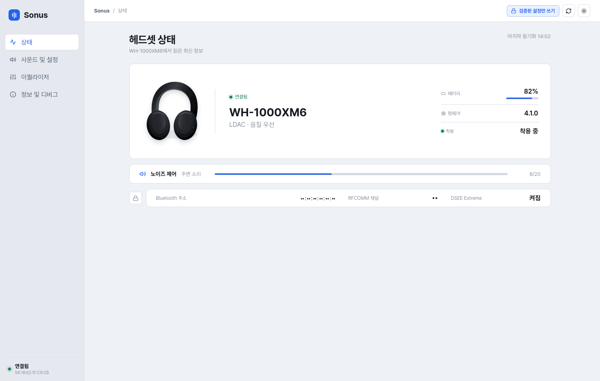
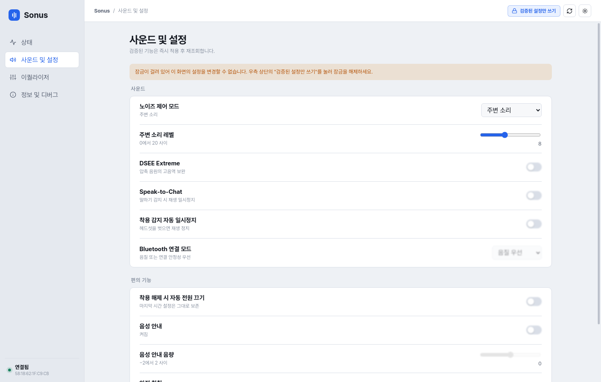
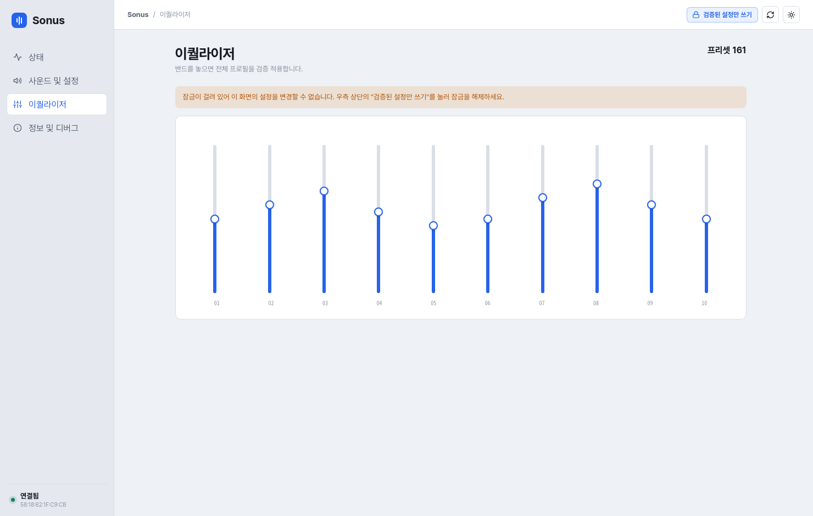

# Sonus

Sony WH-1000XM6를 Linux에서 제어하기 위한 순수 Python 드라이버와 PyQt6
데스크톱 앱 프로젝트다.

## 목적

Sony Sound Connect 앱 없이도 Linux에서 헤드셋 상태를 확인하고 ANC, 앰비언트
사운드, 이퀄라이저와 기기 설정을 제어하는 것이 목표다. 공개 문서가 없는 XM6
제어 프로토콜은 소유한 내 기기에서 관찰한 결과를 바탕으로 구현한다.

## 스크린샷

| 상태                             | 사운드 및 설정                      | 이퀄라이저                      |
| -------------------------------- | ----------------------------------- | ------------------------------- |
|  |  |  |

## 기능

현재 구현:

- BlueZ SDP를 통한 Sony vendor RFCOMM 채널 탐색
- RFCOMM 연결과 지수 백오프 재시도
- 모델, 펌웨어, 배터리, 코덱과 주요 XM6 설정 조회
- 위험 등급 기반 쓰기 차단과 9개 설정의 자동 검증, 원상 복원 (노이즈 제어는
  착용 중에만)
- 실기기 캡처 테스트 자료와 하드웨어 테스트
- 라이트/다크 테마, 시스템 트레이 실시간 상태와 배경 폴링을 갖춘 PyQt6 GUI
- 최초 Disclaimer 동의, 저장 기기 선택, 잠금 해제 확인과 검증된 설정 쓰기를
  갖춘 GUI
- 배터리·주변음 스파크라인과 원시 응답을 보여주는 디버그 패널

확장 예정:

- 안전 청취처럼 저장 상태를 분리 조회하지 못하는 항목의 안전한 제어
- 멀티포인트, 터치 제어 등 추가 기기 설정

## 언어 및 주요 기술

- Python 3.11+
- 표준 라이브러리 `socket`, `argparse`, `dataclasses` — 통신·CLI·자료형
- BlueZ 및 Python `socket` — Bluetooth SDP/RFCOMM 통신
- `pytest` — 단위 테스트와 하드웨어 테스트
- PyQt6, Qt WebEngine — 데스크톱 셸과 로컬 HTML/CSS 인터페이스
- `uv`, Hatchling — 개발 환경과 패키징

## 요구 사항

- Linux와 BlueZ
- Python 3.11 이상
- `uv`
- BlueZ에 페어링되고 신뢰 처리된 WH-1000XM6

## 실행 방법

```bash
git clone <repository-url> sonus
cd sonus
uv sync
./run.sh
```

기기 주소를 미리 알고 있으면 `./run.sh --mac 58:18:62:1F:C9:CB --channel 9`처럼
넘겨도 된다. 생략하면 GUI에서 등록된 기기 목록이나 직접 입력으로 연결할 수 있다.

<details>
<summary>CLI와 개발용 명령</summary>

CLI는 GUI와 별개로 `test_tool/` 아래에 있는 개발용 도구다. 설치되는 패키지에는
포함되지 않으며 `python -m`으로 직접 실행한다.

```bash
# RFCOMM 채널 탐색과 연결 확인 (채널을 모를 때 SDP로 자동 탐색)
uv run python -m test_tool.cli.main probe --mac <HEADSET_MAC>

# 상태와 확인된 모든 설정 조회
uv run python -m test_tool.cli.main status --mac <HEADSET_MAC> --channel 9
uv run python -m test_tool.cli.main settings --mac <HEADSET_MAC> --channel 9 --json

# 항목 하나 조회 또는 검증된 가역 설정 변경
uv run python -m test_tool.cli.main get --mac <HEADSET_MAC> --channel 9 battery
uv run python -m test_tool.cli.main set --mac <HEADSET_MAC> --channel 9 dsee auto

# 단위 테스트 / 실기기 테스트
uv run pytest
uv run pytest -m hardware
```

</details>

정상 연결 시 RFCOMM channel과 protocol-info payload가 출력된다. 정식 쓰기는
실기기에서 변경·재조회·원상 복원·재조회를 확인한 DSEE, EQ, 자동 일시정지,
Speak-to-Chat, 연결 모드, 자동 전원 끄기, 음성 안내와 안내 음량만 허용한다.

GUI는 최초 1회 설정 변경 안내에 동의한 뒤 같은 검증 API로 설정을 적용하고 재조회한다.
노이즈 제어(모드·주변음 레벨)는 착용 중일 때만 쓰기를 허용하며, 안전 청취처럼
원상 복원을 증명하지 못한 항목은 계속 조회 전용이다. 주소를 생략하면 등록 기기
목록 또는 직접 입력으로 연결할 수 있고 이후 동의, 테마, 기기와 창 크기를 기억한다.

`sniff`와 `send`는 프로토콜 개발용 저수준 도구다(`uv run python -m test_tool.cli.main
sniff ...` / `... send ...`). 아직 확인되지 않은 명령을 실기기에 전송하면 설정이
바뀔 수 있으므로 캡처와 명령 의미를 확인한 뒤 사용한다.

## Disclaimer

Sonus는 Sony와 제휴하거나 Sony의 승인, 지원을 받는 공식 제품이 아니다.

헤드셋 설정 변경과 실험적 명령 실행에 따른 책임은 사용자에게 있다. 펌웨어 버전에
따라 동작이 달라질 수 있으므로 자신이 소유하거나 제어 권한이 있는 기기에서만
사용한다.

Sonus는 실 기기를 직접 테스트하며 나오는 공개된 데이터를 기반으로 코드를 작성하여 제작된 소프트웨어이며, Sony 앱, 펌웨어, 바이너리를 역컴파일하거나 포함하지 않고 인증, 보호 장치를
우회하지 않는다. 전원 끄기, 초기화, 페어링 관리와 펌웨어 명령은 안전 정책상
구현하지 않는다.
